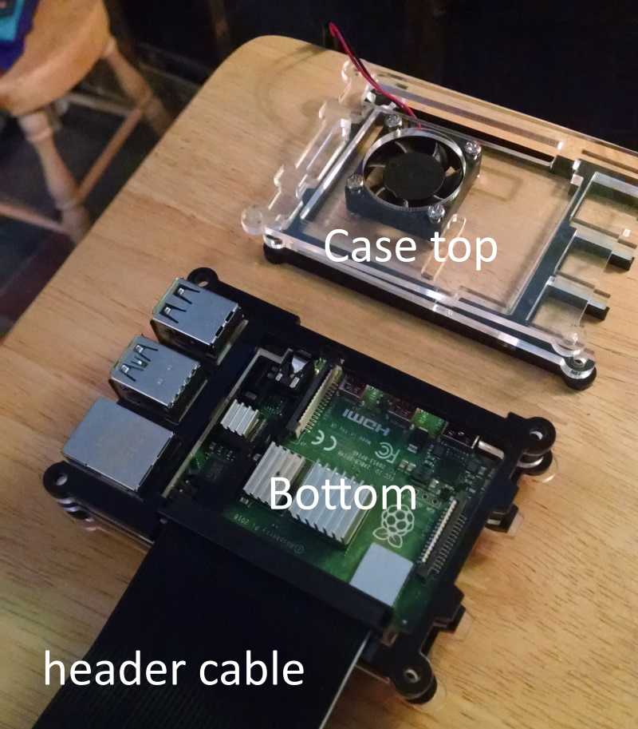
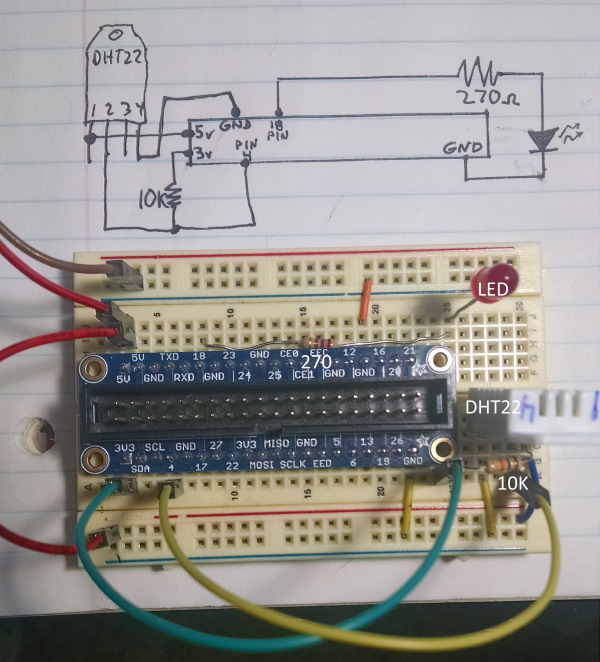
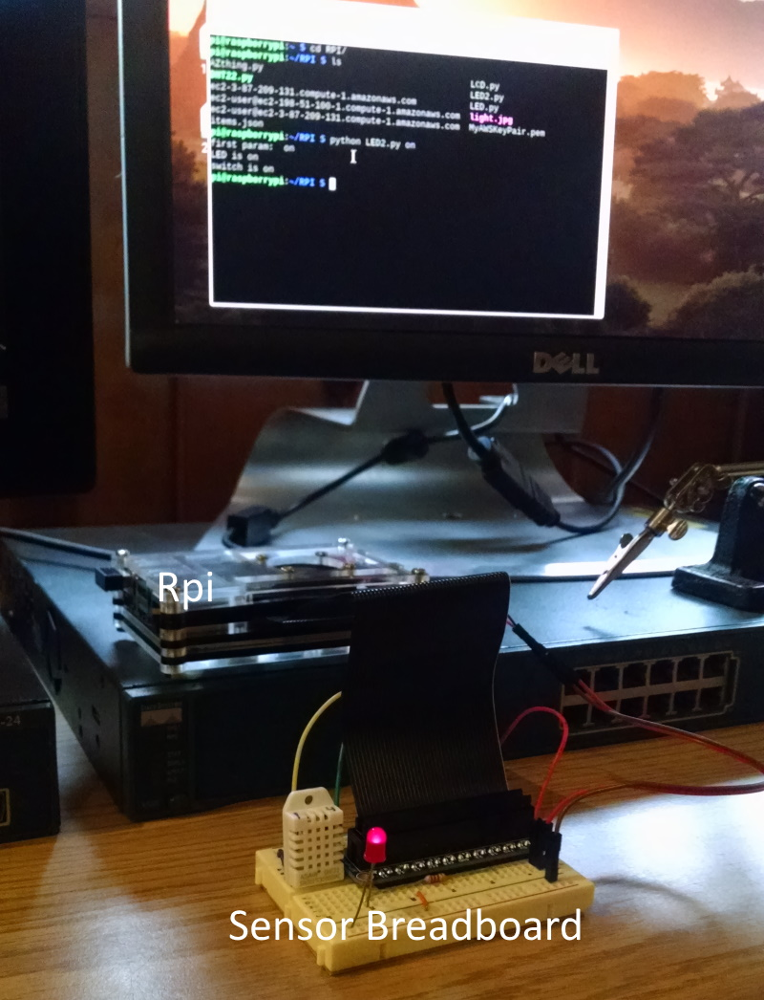

# Serverless Application Design and Implementation Using Raspberry Pi and AWS

## Project Goal:
My primary goal is to create a working model for a basic “Internet of Things” (IoT) serverless application that can be deployed in a working manufacturing environment with existing systems. I wanted the application to be open enough such that it could easily be interfaced to other systems. Another feature I designed into the project is wherever necessary we will use cloud native services to perform the task.
	
## Problem Statement:
The Production department needs to be able to monitor and control the humidity and temperature of a “clean room” producing vegetable produce. The current process is manual involving employees to physically look at gauges, write log entries and adjust a humidifier and thermostat on an hourly schedule. The Production department wants to automate the logging process but still allow for an operator to manually control the heat and humidity through a user interface.   

## The author's personal goals:
My quest is to find out how a serverless application actually works and is billed. I'm also studying for an AWS Developer Certification.

## General Idea of the project:
Essentially what we are going to do in this project is build out a small microcomputer called a Raspberry Pi (Rpi) for use as a sensor and actuator. It's what Amazon calls an "IoT Thing". The Rpi will send real time sensor data to an outgoing software queue and at the same time monitor an incoming software queue for commands it needs to perform such as turn on or off the heat and humidity. After the Rpi is built then it’s just about installing the Python SDKs and writing the code to make it do what we want. This project touches on many technologies you should be familiar with if your goal is to get it working quickly. Here is a short list of some of things you need to know before diving into this:
	
## Prerequisites:
| Tech | Experience |
| --- | --- |
| Basic Electronics | You should know what a breadboard is and be familiar with wiring basic electronic components on one. It’s nice to have a Volt-Ohm-Meter (VOM) as well so you can measure voltages and resitances. |
| Linux/Raspberry Pi | The Rpi is an inexpensive credit card based computer running Linux that has a physical General Purpose Input Output interface or GPIO. This allows us to interface our electronics above. You should know how to build a Rpi and expose the GPIO to the breadboard above. Additionally, you need to know basic Linux (sudo, ls, pwd, chmod….) |
| 	Programming (traditional) | You need to understand the basics of procedural and object based programming. I’ve chosen Python for this project because I've never professionally been paid to write it and it seems to be the best tool to use |
| Amazon AWS Account | We need an account to create our masterpiece.|
| Head on over to |
* Lambda * DynamoDB|
| AWS Lambda | Lamba allows us to create our application logic without a server in the most common languages including Python, Node, Java and .NET core. Using this model we pay only for the time that we use on the processor. |
| AWS Dynamo | We need someplace to store “important” data that our users have acted on. We store the data in this NoSQL database |
| AWS Python SDK | The Python SDK implements Boto3 and is the Python API for higher level functionality beyond what the ASK CLI offers. |
| AWS CLI | A basic command line interface for an AWS client. You should know the operation in both Win10 and Linux. |


## STEP 1: Raspberry Pi Hardware Build

This is the list of materials I used to build the project. The case I used is a little different, I couldn't find the same model
| Item | Site |
| --- | --- |
| Raspberry Pi 4 Model B Kit | https://vilros.com/collections/raspberry-pi-kits/products/vilros-raspberry-pi-4-model-b-complete-starter-kit-with-clear-transparent-case-and-built-in-fan?variant=29406723768414 |
| DHT22 Temperature Humidity sensor | https://www.adafruit.com/product/385 |
| Pi prototyping header | https://www.adafruit.com/product/2029 |
| Electronic prototyping kit | https://www.jameco.com/z/PROTO-KIT-830-Point-Breadboard-with-70-Piece-Jumper-Wire-Kit-Super-Combo_2134993.html |

### Alright, when all the stuff comes in it looks like this:


### First assemble the Pi itself. Read your case manual instructions. This is my case half assembled:



### Now we need to wire up our sensors. Here is an image of both the schematic and the physical wiring:
 

### This is the final assembly all booted and ready to go:


## STEP 2: Install and Enable RDP on the Rpi
Once we are booted up follow any instructions on updating software. As you can see, I attached a monitor and a wireless keyboard/mouse up to the Rpi but that’s because it’s a prototype. In the real world it would be a box with a probe sticking out and 4 wires to control heat and humidity. That being said, we need to be able to remote to the Rpi for development.

Use the following guide to setup RDP on the Rpi:
http://www.circuitbasics.com/access-raspberry-pi-desktop-remote-connection/

## STEP 3: Install the Sensor drivers
* Open a terminal session and type: `sudo pip install Adafruit-DHT`
* Create a directory for our code type: `mkdir RPI`
* Open Thonny by clicking Start -> Programming -> Thonny
* In Thonny open a new file (File -> New)
* Copy the code below and paste it into Thonny

```python
import sys
import board
import Adafruit_DHT 
import time

def get_Sensor_Data():
    rc = False
    Hum = 0.0
    Temp = 0.0
    try:
        sensor = Adafruit_DHT.DHT22
        pin = 4
        Hum, Temp = Adafruit_DHT.read_retry(sensor, pin)
        rc = True
        Temp = Temp * 9/5.0 + 32
        #print("get_Data():Temp= ", Temp)
        return Hum, Temp, rc
    except RuntimeError as error:
        # Errors happen fairly often, DHT's are hard to read, just keep going
        print("runtume error caught: get_Sensor_Data() on sensor DHT22")
        return Hum, Temp, rc

while True:
    try:
        humidity, temp, result = get_Sensor_Data()
        
        if result:
            print('Temp={0:0.1f}*'.format(temp))            
            print('Humidity={0:0.1f}%'.format(humidity))  
        else:
            print("Invalid data")

        time.sleep(5)

    except (EOFError, SystemExit, KeyboardInterrupt):
        sys.exit()
    except RuntimeError as error:
        # Errors happen fairly often, DHT's are hard to read, just keep going
        print(error.args[0])

```

* Run the code in Thonny. Run -> Run current script
* Hit the red stop button after a few seconds. You should see something like this in the output:
	+ Temp=59.2*
	+ Humidity=32.2%
* If you get the results above we know the DHT22 is wired correctly. If not, check your wiring.


## STEP 4: Test the sensor's actuator
Our sensor needs to be able to turn on and off heat and humidity. We are going to simulate this on our sensor using LEDs. To program this we are going to set a couple of GPIO pins to output mode and interface them to a LED. I’m going to show just one control pin for now. We will use it to turn on a red LED. Let say the red LED represents a heating element being turned on.

If you wired the Rpi as I have shown in the pics above then you have wired a LED to a 270 ohm resistor and tied one end to pin 18, the other to ground. We can turn the LED on and OFF with a simple script. On the Rpi, open Thonny and create a new file called LED.py. Paste the following into the file and save it to the /RPI directory.

```python
#-- LED.py --
import RPi.GPIO as GPIO
import sys

GPIO.setwarnings(False)
GPIO.setmode(GPIO.BCM)
LED = 18
GPIO.setup(LED, GPIO.OUT)
    
def LEDon():
    GPIO.output(LED,GPIO.HIGH)
    print("LED is on")

def LEDoff():
    GPIO.output(LED,GPIO.LOW)
    print("LED is off")

arguments = len(sys.argv) - 1

if (arguments < 1) :
    print("usage: LED on\nor LED off\npython3 LED on")

if arguments > 0:
    print("first param: ", sys.argv[1])
    if (str(sys.argv[1]) == "on") :
        LEDon()
        print("switch is on")
    if (str(sys.argv[1]) == "off") :
        LEDoff()
        print("switch is off")
#-- END LED.py –
```

* With the file saved as LED.py
* Open a terminal session and type: `cd RPI`
* Type: `sudo pip install RPi.GPIO`
* Run the script above by typing: `python LED.py on` This will turn the LED on
* Turn the LED off by typing: `python LED.py off`

If this doesn’t work check your wiring. One thing that I will add is that if the LED doesn’t light up the first time try reversing the leads. It’s a diode and as such allows current to flow only in one direction. The other thing to mention is the value of the resistor controls how bright the LED is. I originally was using a green LED with a 270 ohm resistor and it would not light up. I switched to a red LED and everything worked. Try a lower value resistor if it’s not bright enough but make sure you use a resistor because you could damage the IO buss if you are drawing too much current.

## STEP 5: Amazon Web Services
At this point in time we now have a working sensor that we can remote to. Put it somewhere in your house and connect it to your network. In this next section we are going to configure the sensor to talk to Amazon Web Services (AWS)


