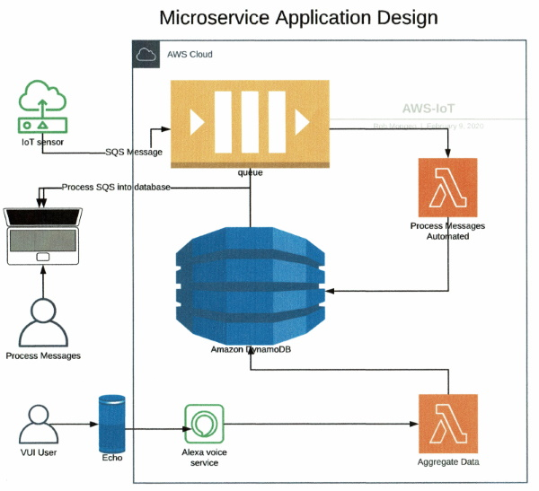

# Serverless Application Design and Implementation Using Raspberry Pi and AWS
## Part 2 of 3: Application Design

## High Level Overview:
This is a serverless, event driven application. The major modules of this application are broken down into separate functions using various AWS services. The design pattern is similar to Service Oriented Architecture (SOA) and is stateless by nature. Here is a high level overview of my design:

I kept the overall design in this stage small in order to get a simple proof of concept running. Adding additional modules to this application should be a simple task after we define the infrastructure.

## Operation:
The heart of this application really is the software Queue. We are going to define a Queue using the SNS service. The Queue will serve as a place to store our tasks in the form of messages. Amazon designed SQS based loosly on [MQTT](http://http://mqtt.org/). The Python SDK for MQTT is called [Paho](https://pypi.org/project/paho-mqtt/) Spend some time learning MQTT as it's basically how IoT works on any cloud platform. I'm going to be using a single Queue for this module. My thought was 1 Queue for each major function.

Previously we built out and tested our Rpi IoT sensor. We are going to use the Rpi to poll the room for temperature and humidity once every hour and send that data to the Queue. The Rpi also has to monitor the Queue for specific messages asking it to turn on/off a switch that controls heat.

Once the data is in the Queue we can process it how we like. My diagram shows an external user editing the data and sending it off to a DynamoDB table for long term storage. Additionally, we can write automated trigger functions that monitor the data content and perform some type of action based on a directive that we define. 

We are going to use DynamoDB to store our processed data. Once it's in Dynamo we can do what we want with it. My example is showing a user using an Alexa device. The function we are going to write simply queries DynamoDB for the most up to date sensor data and tells this to the user. That's good enough to start with. 

That pretty much explains what I want to accomplish with this project. It's basically a template that can be used for a variety of applications. 

## Cloud Prerequisites:
You should have some cloud experience before attempting to do this. I'm not going to explain the details of IAM for instance. Here is a list of what we are working with:

| Service | Usage |
| --- | --- |
| SQS | A Simple Queue Service modeled after MQTT |
| Lambda | Lambda is where our cloud code lives. We will be creating Lambda functions for automated processes |
| IAM | IAM is the security mechanism AWS uses to define permissions, users, roles and policies |
| DynamoDB | Dynamo is our NoSQL database. I'm fairly new to NoSQL. If you have relational database experience you should be fine |
| Alexa | We will be using the Alexa Python SDK for Alexa skill development |
| Alexa Developer Console | This is where we create our Alexa skill |
| Boto3 | Boto3 is the Python module we will use to interface the various cloud components together |

## Software Development:
I'm using the Python 3 stack on both the Win10 and Rpi hosts. I use Visual Studio Code on Windows and Thonny on the Rpi. You can use what you want. The choice for me was Visual Studio Code vs. Eclipse. I chose VS Code because I use it every day.

Testing and debugging the code can be challenging just based upon the environment we are using. For instance, how do you step through code on a cloud service? My strategy has been to construct a wrapper around the cloud function so I can execute it locally. Once it runs clean I "unwrap" it and add some CloudWatch logging. I'm fairly new to cloud debugging so I'll be learning along the way.

## Author Notes:
Python is new to me. I started playing with it in 2019. My professional experience is in ANSI C, Visual Basic and Java. The last professional code I wrote was back in 2014. This is my attempt to update my developer toolbox and get back into software development.

