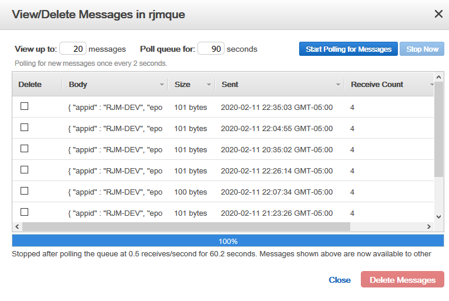

# Serverless Application Design and Implementation Using Raspberry Pi and AWS

## Implementing SQS
Amazon Simple Queue Services (SQS) is the heart of this application. We are going to create a message queue and use it to drive our serverless application. At first our Queue will be used to transmit the data that we intend to process. We can then use event triggering and event subscription functions to drive the application as a whole.

## Create a SQS Queue:
* Login to AWS console
* Services -> Simple Queue Service
* Create Queue -> Name it remote_data
* choose Standard Queue
* choose Quick-Create

## Send some data
Take a good look at the [Boto3 SQS Documentation](https://boto3.amazonaws.com/v1/documentation/api/latest/guide/sqs-examples.html) For this module we just need to be able to send the state of the sensor data. We will send this in the following JSON format representing a Python dictionary object: 

```json
{ "appid" : "RJM-DEV", "epoch" : "1581474206", "temp" : "63.3", "humidity" : "33.5", "cpu" : "12.2" }
```

I had two forward thoughts about this message body. The first two keys in this dictionary define the target application and the time the message was sent. We will use this fact later when we go to process the data but think about how you could have different modules process different data sets by looking at the APPID key first. We will start small at first.

## Write some code
For this part of the project I have assumed you have completed:
* [Raspberry Pi Build](Rpi-sensor.md)
* [SDK Install](SDK-install.md)

Remote to the Rpi host and open Thonny. Paste the following code into a new file:

```python
#!/usr/bin/python3
import psutil
import sys
import Adafruit_DHT
import datetime
import time
import logging
import boto3
from botocore.exceptions import ClientError

def get_Sensor_Data():
    rc = False
    Hum = 0.0
    Temp = 0.0
    try:
        sensor = Adafruit_DHT.DHT22
        pin = 4
        Hum, Temp = Adafruit_DHT.read_retry(sensor, pin)
        rc = True
        Temp = Temp * 9/5.0 + 32
        return Hum, Temp, rc
    except RuntimeError as error:
        # Errors happen fairly often, DHT's are hard to read, just keep going
        print("runtume error caught: get_Sensor_Data() on sensor DHT22")
        return Hum, Temp, rc

# Sends a message to an AWS queue
def send_sqs_message(sqs_queue_url, msg_body):
    # Send the SQS message
    sqs_client = boto3.client('sqs')
    try:
        msg = sqs_client.send_message(QueueUrl=sqs_queue_url,
                                      MessageBody=msg_body)
    except ClientError as e:
        logging.error(e)
        return None
    return msg

sqs_queue_url = 'https://queue.amazonaws.com/68300xxxxxxx4/rjmque'

try:
    humidity, temp, result = get_Sensor_Data()
    cpu_percent = psutil.cpu_percent(interval=None)
    strTimeStamp = "\"time\": \"{}\"".format(datetime.datetime.now())
    seconds = time.time()
    
    if result:
        #format each field into a json field
        strApID = "\"appid\" : \"RJM-DEV\""
        strTemp = "\"temp\" : \"{0:0.1f}\"".format(temp)
        strHum = "\"humidity\" : \"{0:0.1f}\"".format(humidity)
        strCPU = "\"cpu\" : \"{0:0.1f}\"".format(cpu_percent)
        strEpoch = "\"epoch\" : \"{0:0.0f}\"".format(seconds)
        
        msg_body = '{' + ' ' + strApID + ', ' + strEpoch + ', ' + strTemp + ', ' + strHum + ', ' + strCPU + ' }'
        msg = send_sqs_message(sqs_queue_url, msg_body)
#        print(msg_body)        
         
        if msg is not None:
            print(f'Sent SQS message ID: {msg["MessageId"]}')
            
    else:
        print("Invalid data")

except (EOFError, SystemExit, KeyboardInterrupt):
    sys.exit()
except RuntimeError as error:
    print(error.args[0])
```
Save the file as send_temp_json.py in the RPI folder. 

## Execute your code

Run it from Thonny and you should see something like:
    `Sent SQS message ID: c25955af-8a3e-4a0d-b25b-7e6292a2f649`

Open a terminal session and run the script from the command line:
    `root@raspberrypi:/home/pi/RPI#python send_temp_json.py`

You should see the same as above but note that you can run this from the command line.

## Automate the code
We have seen that we can run the code from the command line above. Now we just need to run the command once every hour. In the Linux world this means were are going to setup a `cronjob`. [Follow These Steps](https://www.raspberrypi.org/documentation/linux/usage/cron.md) to create an hourly task to run the script above.

## Check your Queue for data
Assuming we have data being sent to our Queue once every hour lets take a look at what's in the Queue. From the AWS Console choose Simple Queue Service and you should see your queues. Check the Queue you want to look at and click Queue Actions -> View/Delete messages. 

You should see something like this:


## Review:
Let look at what we did in this module. We have defined an SQS Queue and can send data to it on an hourly basis.

# [Return](README.md)


